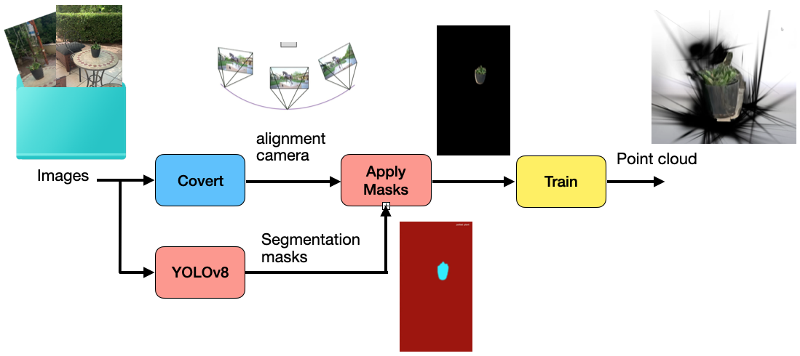
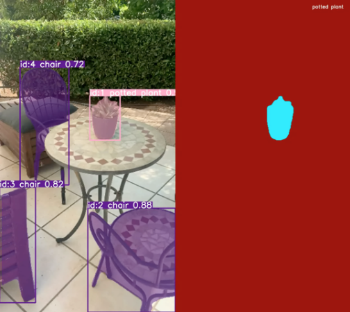

# 3D Gaussian Splatting with YOLOv8

Gaussian splatting (GS) is a method for representing 3D objects using 3D Gaussian distributions instead of polygons. Typically, the user captures a series of images of the same scene and generates the 3D Gaussian splatting through optimization training. Recently, with advancements in AI and GPU technology, this training process has become faster and can produce solutions in a reasonable amount of time.

In this project, I aimed to use YOLO segmentation to create a mask and limit the number of pixels used in training. This approach ensures that only the desired objects are included in the final result.

- After aligning the images, we apply the mask generated by YOLO to limit the input images.

---
A video example of the output can be seen here: [Watch the Video](read_me_images/pot_video.mov).